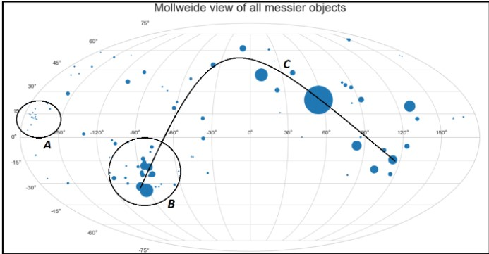

# python-astropy

### Messier Objects
The Messier objects are a set of 110 astronomical objects catalogued by the French astronomer Charles Messier in his Catalogue des Nébuleuses et des Amas d'Étoiles ("Catalogue of Nebulae and Star Clusters"). The catalogue consists of a diverse range of astronomical objects, from star clusters and nebulae to galaxies. 
For example, Messier 1 is a supernova remnant, known as the Crab Nebula, and the great spiral Andromeda Galaxy is M31.

Here is a picture of stars which are members of open star cluster M45:

<figure class="image">
  
  <figcaption>Source: NASA, ESA and AURA/Caltech</figcaption>
</figure>
 

In this project, we have plotted all the messier objects in Mollweide View, took a messier object as input, presented its details and also plotted the Sky View of it, in python with the help of the Astropy library.

##Logic Used
We have used Right Ascension and Declination to identify the locations of all the Messier objects.
For it, we have imported the data from the datasheet given in reference which had information about Right Ascension, Declination and Magnitude of all the Messier objects. Finally, we have plotted it in Mollweide projection and Sky View.
<figure class="image">
  
</figure>`

## Sample Output
### 1.
<figure class="image">
  
</figure>
<b>Region A:</b> Objects in this part of the sky are Galaxies present in the Virgo SuperCluster. 
<b>Region B:</b> Objects in the part of the sky lie at the center of Milkyway Galaxy. 
<b>Line C:</b> Objects on this line from the Arc of Milkyway Galaxy as seen from Earth. 

### 2.

  
   

